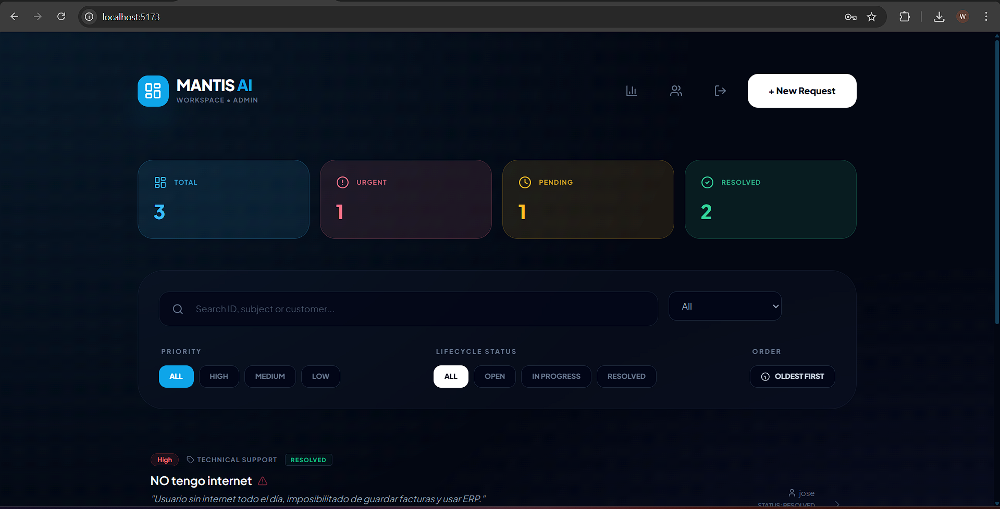
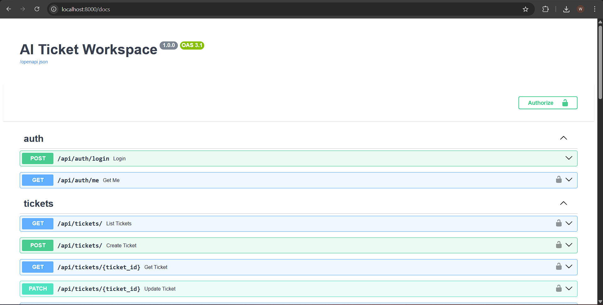

# Mantis AI - Advanced Ticket Management & Intelligence Workspace

Mantis AI es una plataforma de gestión de solicitudes operativas de nivel empresarial potenciada por Inteligencia Artificial de última generación (Gemini Pro). Diseñada para automatizar el ciclo de vida completo de un ticket, desde su creación y triaje automático hasta el análisis estratégico de rendimiento y auditoría forense.

---

## Funcionalidades Principales

### 1. Motor de Inteligencia Artificial (AI Triage)
El sistema utiliza modelos de lenguaje extenso (LLM) para eliminar la carga administrativa manual:
- **Clasificación Automática:** Análisis de lenguaje natural para asignar categorías (Legal, Finanzas, Operaciones, Soporte, etc.) con precisión semántica.
- **Priorización Dinámica:** Evaluación del nivel de urgencia (Alta, Media, Baja) basada en el contexto del requerimiento.
- **Resumen Ejecutivo:** Generación instantánea de síntesis de máximo 15 palabras para facilitar la lectura rápida de los agentes.
- **Asignación Inteligente:** La IA selecciona automáticamente al agente de soporte más idóneo basándose en la disponibilidad y departamento, marcando el registro con la etiqueta `Assigned by AI`.

### 2. Gestión Avanzada de Tickets
- **Ciclo de Vida Completo:** CRUD completo con estados operativos (Open, In Progress, Resolved).
- **Transferencia y Sincronización:** Lógica de negocio que sincroniza automáticamente el área/categoría del ticket cuando es reasignado a un nuevo agente de un departamento distinto.
- **Control de Resolución:** Registro automático de la marca de tiempo (`resolved_at`) para métricas de SLA.
- **Filtrado Multidimensional:** Segmentación por estado, prioridad, departamento y búsqueda por texto.

### 3. Colaboración y Mensajería Especializada
- **Feed de Actividad Real-time:** Historial cronológico de comentarios dentro de cada ticket.
- **Notas Internas (Solo Soporte):** Capacidad de añadir comentarios marcados como `is_internal`. Estos son **invisibles para el usuario final** y sirven para la colaboración técnica privada entre agentes.
- **Validación de Roles:** Los empleados solo pueden editar el contenido original de su ticket, mientras que el soporte gestiona la resolución y comentarios.

### 4. Centro de Inteligencia y Analítica (BI)
Un panel de control diseñado para la toma de decisiones estratégicas:
- **Métricas de Eficiencia:** Cálculo automático del tiempo promedio de resolución por agente y por departamento.
- **Indicadores de Carga:** Matrices visuales de tickets pendientes vs. resueltos.
- **Ranking de Usuarios:** Identificación de los generadores de tickets más frecuentes.
- **Informes Estratégicos AI:** Generador de reportes en lenguaje natural que analiza los datos de rendimiento y logs de auditoría para detectar cuellos de botella y sugerir acciones concretas.

### 5. Seguridad y Auditoría Forense
- **RBAC (Role-Based Access Control):** Tres niveles de acceso estrictos:
  - **Admin:** Acceso total, analíticas globales y auditoría completa.
  - **Soporte:** Gestión de tickets asignados, comentarios internos y cambios de estado.
  - **Empleado:** Creación de tickets y seguimiento de sus propias solicitudes.
- **Registro Inmutable (Audit Log):** Cada cambio en campos críticos (Estado, Dueño, Prioridad) queda registrado con el usuario, fecha, valor anterior y valor nuevo.
- **Protección de Datos:** Autenticación OAuth2 con JWT, hashing de contraseñas Bcrypt y validación de esquemas con Pydantic.

---

## 🛠 Arquitectura Técnica

### Backend (FastAPI + SQLModel)
- **Engine:** Python 3.12.
- **ORM Moderno:** SQLModel para tipado fuerte y validación de base de datos.
- **AI Integration:** Google Gemini Pro API.
- **Seguridad:** OAuth2 + JWT Bearer tokens.

### Frontend (React + Vanilla CSS)
- **Estructura:** Componentes funcionales con Hooks (UseState, UseEffect, UseContext).
- **Estética Premium:** Diseño minimalista con modo oscuro, gradientes dinámicos y micro-animaciones.
- **Comunicación:** Axios con interceptores de seguridad.

---

## Instalación y Despliegue

### Requisitos Previos
- Docker & Docker Compose.
- API Key de Google AI (Gemini).

### Pasos de Despliegue
1. **Clonar y Configurar:**
   Crea un archivo `.env` en la raíz con:
   ```env
   GOOGLE_API_KEY=tu_llave_aqui
   DATABASE_URL=postgresql://postgres:postgres@db:5432/ticket_db
   ```

2. **Levantar Entorno:**
   ```bash
   docker-compose up --build
   ```

3. **Inicializar Datos (Seed) de prueba:**
   Para cargar el personal de prueba en (Agentes de Legal, Finanzas, etc.):
   ```bash
   docker exec -it ticket_backend python -m app.scripts.seed_dummy
   ```

---

## Endpoints Clave
- **Web App:** `http://localhost:5173`



- **Interactive API Docs:** `http://localhost:8000/docs`



- **Analytics API:** `http://localhost:8000/api/v1/analytics/summary`


